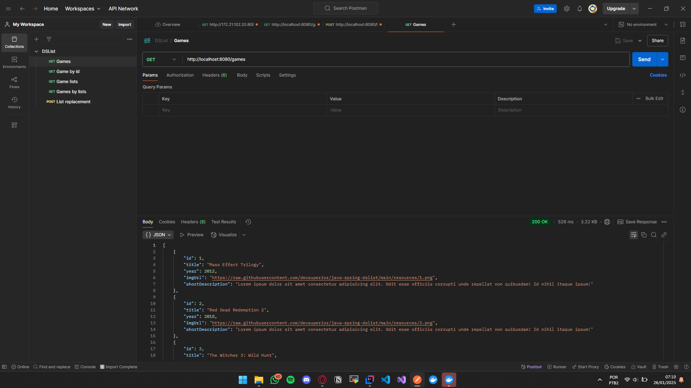
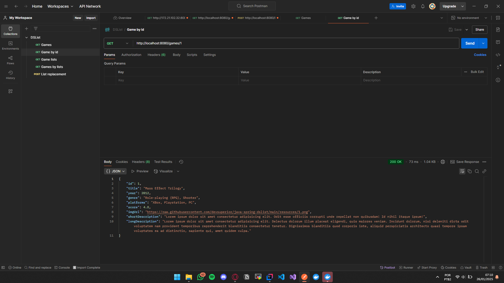
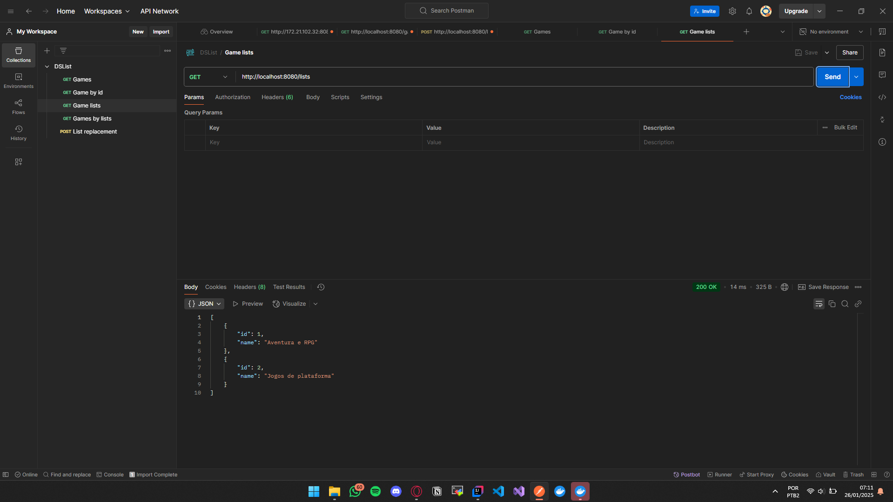
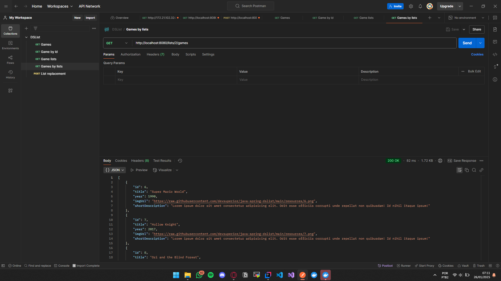
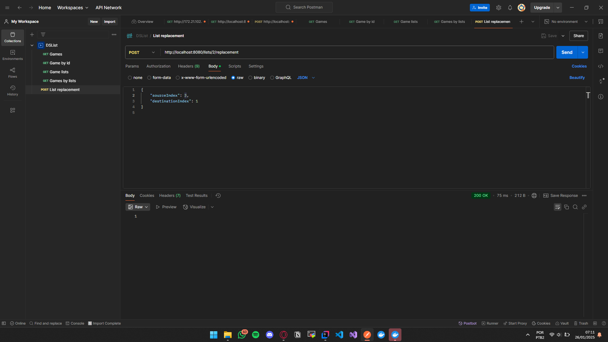

# DSList - API for Game List Management

DSList is a Java Spring Back-end application that provides an API to manage game lists. The application allows retrieving detailed information about games, their lists, and performing operations such as replacing game lists.

## Technologies Used

- **Java 17**
- **Spring Boot**
  - Spring Web
  - Spring Data JPA
  - Spring PostgreSQL Driver
- **H2 Database** (for development)
- **PostgreSQL** (for production)
- **Docker** (for containerization)
- **Postman** (for API testing)

## Domain Model

The application is based on the domain model below:

- **Game**: Represents a game, with attributes such as title, release year, genre, available platforms, score, and descriptions.
- **GameList**: Represents a custom game list.
- **Belonging**: Association class that defines the position of a game within a list.


## Available Endpoints

### GET /games

Returns the games with they short description.

- **Example response:**

```json
[
  {
    "id": 1,
    "title": "The Legend of Zelda: Breath of the Wild",
    "year": 2017,
    "genre": "Adventure",
    "platforms": "Nintendo Switch",
    "score": 9.7,
    "imgUrl": "https://example.com/image.jpg",
    "shortDescription": "Explore the vast world of Hyrule.",
    "longDescription": "Open-world adventure game that redefines the genre."
  }
]  
```


---

### GET /games/{id}

Returns the details of a specific game by ID.

- **URL Parameter:** `id` (Long)
- **Example response:**

```json
{
  "id": 1,
  "title": "The Legend of Zelda: Breath of the Wild",
  "year": 2017,
  "genre": "Adventure",
  "platforms": "Nintendo Switch",
  "score": 9.7,
  "imgUrl": "https://example.com/image.jpg",
  "shortDescription": "Explore the vast world of Hyrule.",
  "longDescription": "Open-world adventure game that redefines the genre."
}
```

---

### GET /lists

Returns all registered game lists.

- **Example response:**

```json
[
  {
    "id": 1,
    "name": "Favorites"
  },
  {
    "id": 2,
    "name": "Games of 2023"
  }
]
```

---

### GET /lists/{id}/games

Returns all games associated with a specific list.

- **URL Parameter:** `id` (Long)
- **Example response:**

```json
[
  {
    "id": 1,
    "title": "The Legend of Zelda: Breath of the Wild",
    "year": 2017,
    "genre": "Adventure",
    "platforms": "Nintendo Switch",
    "score": 9.7
  }
]
```

---

### POST /lists/{id}/replacement

Replaces the order of games within a list.

- **URL Parameter:** `id` (Long)
- **Request Body:**

```json
{
  "sourceIndex": 0,
  "destinationIndex": 2
}
```

- **Example response:** `HTTP 204 No Content`

---
## Development Environment Setup

1. Clone this repository:
   ```bash
   git clone https://github.com/your-username/dslist.git
   ```

2. Navigate to the project directory:
   ```bash
   cd dslist
   ```

3. Run the project in the development environment using the H2 database:
   ```bash
   ./mvnw spring-boot:run
   ```

4. Access the H2 console at: [http://localhost:8080/h2-console](http://localhost:8080/h2-console)

## Testing with Postman

- Import the Postman collection file included in the repository to test the available endpoints.

## Containerization with Docker

1. Build the Docker image:
   ```bash
   docker build -t dslist .
   ```

2. Run the container:
   ```bash
   docker run -p 8080:8080 dslist
   ```

## Final Considerations

This project was developed with a focus on practicing Spring Boot, JPA, and RESTful API concepts. Feel free to contribute or report issues in the Issues tab.

---

**Author:** Gariel Aldiney
**License:** Intensivão Java Spring - Dev Superior
